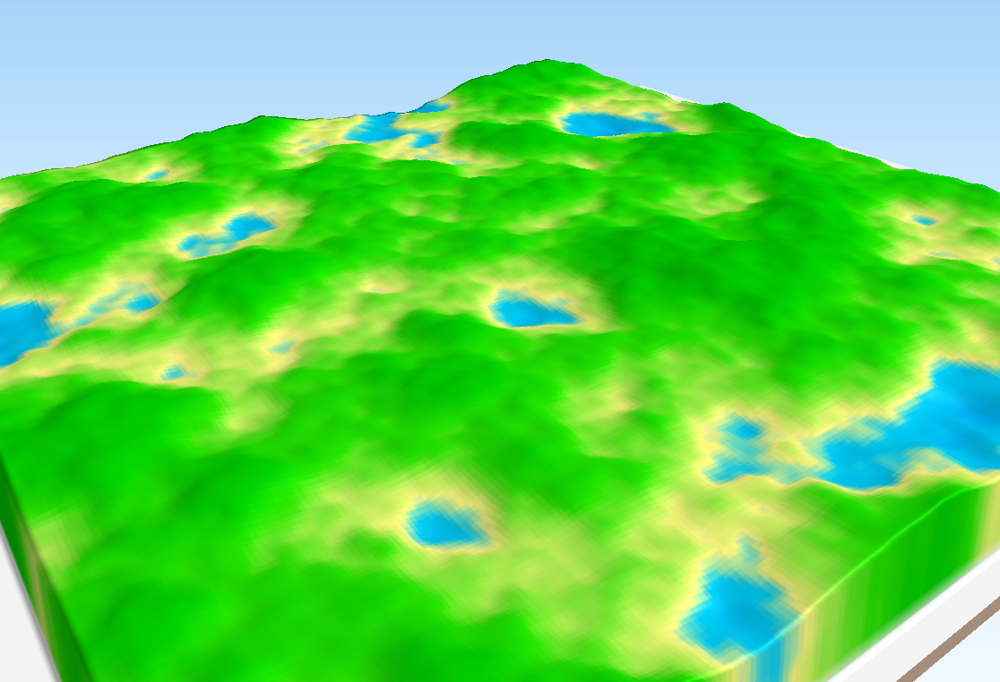

# GAMA : Génération Automatique de MNT Aléatoire
## Projet personnel 2, TSI 2017, Amaury Zarzelli

### Introduction

La bibliothèque GAMA permet de générer aléatoirement des cartes d'élévation de terrain à l'aide de plusieurs algorithmes de génération procédurale, et leur export aux formats ASC et GeoTiff.
À l'heure actuelle, GAMA permet de générer un terrain selon 4 méthodes différentes :
+ le bruit de Perlin,
+ la méthode diamant-carré,
+ un bruit par valeur aléatoire,
+ un aléatoire pur (non recommandé).

### Prérequis

+ Java Development Kit (JDK) 8

+ (Conseillé) Maven

### Installation à l'aide de Maven

#### Depuis le répertoire du projet

Après téléchargement et décompresion de l'archive du projet, ouvrir un terminal dans le dossier gama, et lancer la commande
```sh
$ mvn install
```

#### Depuis le package .jar du projet (version 0.0.1-SNAPSHOT)

Après téléchargment du package, ouvrir un terminal dans le dossier contenant le fichier .jar, et lancer la commande
```sh
$ mvn install:install-file -Dfile=gama-0.0.1-SNAPSHOT.jar -DgroupId=eu.ensg.tsi.azarzelli -DartifactId=gama -Dversion=0.0.1-SNAPSHOT -Dpackaging=jar
```

### Ajout de la dépendance à votre projet Maven (version 0.0.1-SNAPSHOT)

Après installation de GAMA, dans votre projet Maven, rajouter entre les balises <dependencies> de votre pom.xml les lignes suivantes :
```xml
<dependency>
     <groupId>eu.ensg.tsi.azarzelli</groupId>
     <artifactId>gama</artifactId>
     <version>0.0.1-SNAPSHOT</version>
</dependency>
```

### Utilisation de la bibliothèque GAMA pour la génération procédurale de MNT

Un utilisateur normal de GAMA n'utilise que la classe Terrain de la bibliothèque. N'oubliez donc pas d'ajouter la ligne
```java
import eu.ensg.tsi.azarzelli.gama.domain.Terrain;
```
au début de votre fichier java utilisant la bibliothèque. (Votre IDE devrait vous le rappeler dans tous les cas !)

#### Construction de l'objet Terrain

En fonction de votre utilisation de l'API, plusieurs constructeurs de Terrain sont disponibles :

+ Construction par la méthode de génération :
    ```java
    Terrain monTerrain = newTerrain("PerlinNoise");
    ```
    Ce constructeur prend en argument le nom de la méthode voulue (non sensible à la casse) parmi
	+ PerlinNoise
	+ RandomNoise
	+ DiamondSquare
	+ Random
	 
    Le terrain résultant aura 256 lignes et 256 colonnes. Pour ne pas utiliser les dimensions par défaut, utiliser
    ```java
    int monNombreDeLignes = 10;
    int monNombreDeColonnes = 200;
    Terrain monTerrain = newTerrain("PerlinNoise", monNombreDeLignes, monNombreDeColonnes);
    ```


+ Construction par les coordonnées du MNT :
	```java
	// Coordonnées du coin inférieur gauche
	double xMin = 0;
	double yMin = -15.5;

	// Coordonnées du coin supérieur droit
	double xMax = 320.12;
	double yMax = 73;
	
	// Taille d'un pixel (dans les mêmes unités que les coordonnées)
	double cellSize = 5.5;

	Terrain monTerrain = new Terrain(xMin, yMin, xMax, yMax, cellSize);

	```
	Si vous voulez préciser le système de référence utilisé (par défaut il s'agit du web Mercator, EPSG:3857), faites-le en premier argument à l'aide d'une chaîne de caractères du type "EPSG:xxxx"
	```java
	Terrain monTerrain = new Terrain("EPSG:2154", xMin, yMin, xMax, yMax, cellSize);
	```

	Par défaut, la méthode de génération du MNT est le bruit de Perlin. Cela est modifiable à l'aide un setter (section ["Modifier l'objet Terrain"](#modifier-l'objet-terrain))


+ Construction à partir d'un fichier géographique :
	```java
	Terrain monTerrainDepuisUnRaster = new Terrain("/chemin/vers/mon/fichier.tif", Terrain.RASTER_FILE);
	Terrain monTerrainDepuisUnVecteur = new Terrain("/chemin/vers/mon/fichier.shp", Terrain.VECTOR_FILE);
	```
	Les types supportés sont les types supportés par l'API GeoTools (http://docs.geotools.org/stable/userguide/geotools.html)
	Par défaut, la méthode de génération du MNT est le bruit de Perlin. Cela est modifiable à l'aide un setter (section ["Modifier l'objet Terrain"](#modifier-l'objet-terrain))


#### Modifier l'objet Terrain
##### Modifier la méthode de génération
Pour changer l'algorithme de génération procédurale de terrain, utiliser la fonction
```java
terrain.setGenerationMethod("randomNoise");
```
Cette fonction prend en argument le nom de la méthode voulue (non sensible à la casse) parmi
+ PerlinNoise
+ RandomNoise
+ DiamondSquare
+ Random
Si le nom donné en argument ne correspond à aucune des méthodes précédentes, on gardera la méthode de génération initiale.


##### Ajouter un facteur d'altitude
Par défaut, les MNT générés par un objet Terrain ont des valeurs comprises entre 0 et 1.
Si vous souhaitez obtenir des valeurs entre 0 et une altitude donnée différente de 1, utiliser la fonction suivante avant de générer le MNT :
```java
terrain.setAltitudeFactor(1826); // Pour avoir un terrain qui va aussi haut que la montagne de Lure !
```

#### Générer le MNT
Une fois votre objet Terrain prêt à générer le MNT souhaité, utiliser la commande
```java
terrain.generate();
```
Et voilà ! Un MNT aléatoire a été calculé dans votre objet Terrain. Il ne reste plus qu'à...


#### Exporter le MNT
Pour exporter le MNT généré, utiliser les fonction suivantes :
```java
// Export au format asc
terrain.toAsc("/chemin/vers/mon/nouveau/fichier.asc");
// Export au format geotiff
terrain.toGeotiff("/chemin/vers/mon/nouveau/fichier.tif");
```

Vous n'avez plus qu'à ouvrir le fichier obtenu dans votre SIG préféré (ici, QGIS), et utiliser par exemple des outils de visualisation 3D (ici, Qgis2threejs) pour admirer le résultat du calcul.

Exemple de MNT calculé par bruit de Perlin sur un carré de 256x256 pixels

