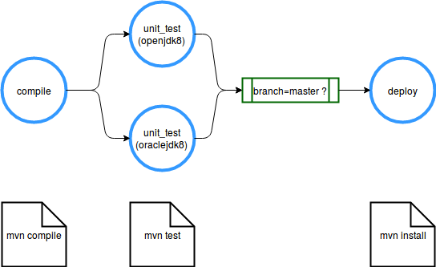
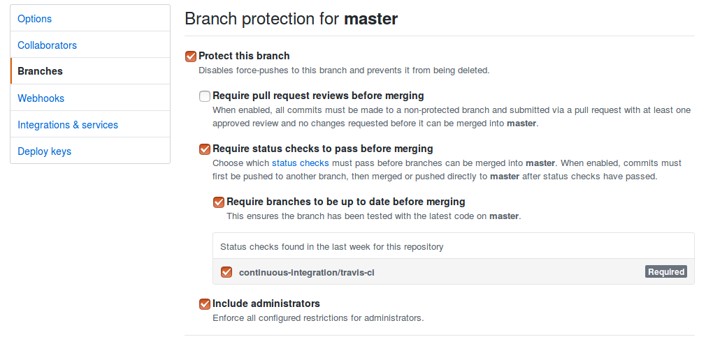
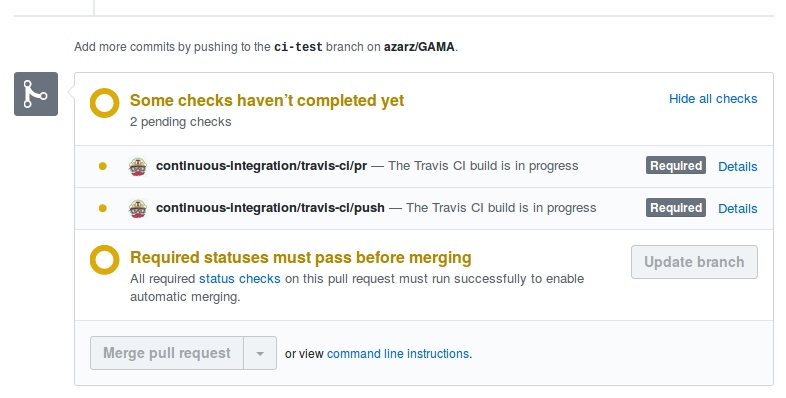

# Intégration continue - rendu (Amaury Zarzelli)

### Outil utilisé : Travis CI
Accès aux résultats des builds : https://travis-ci.org/azarz/GAMA

### Pipeline utilisée

La pipeline est définie par le fichier [travis.yml](../.travis.yml)

Les 3 étapes demandées dans les consignes pour la pipeline étaient Contruire, Tester, Déployer.
De ce point de vue, les étapes de la pipeline ne correspondent pas tout à fait car construire correspond plutôt, avec Maven, aux étapes mvn compile, mvn test puis mvn build, tester à mvn verify et déployer à mvn deploy.
Cependant, le projet GAMA ayant été réalisé sans tests d'intégration, il m'a semblé plus pertinent de faire correspondre à l'étape de tests les test unitaires, et donc de limiter la phase de construction à la commande mvn compile. Faire autrement n'aurait pas changé outre mesure l'écriture du fichier .travis.yml, pour lequel seuls les commandes (scripts) auraient changé avec des commandes maven différentes.
De plus, étant donné qu'aucun dépôt distant n'était défini dans le projet, j'ai limité la phase de déploiement à l'installation sur la machine locale (mvn install).

#### Étape parallélisée

L'une des demandes était de paralléliser une étape de la pipeline. Cela a été réalisé à l'étape de test, dans laquelle la commande est lancée en utilisant 2 JDK : openJDK et oracleJDK, et ce en parallèle. Cela est possible grâce à la commande jdk_switcher.

#### Déploiement conditionnel

Le déploiement est de plus conditionnel : il n'a lieu que si la branche courante est la branche master. Encore une fois, cela n'aurat été utilise que si la commande utilisée avait été mvn compile.

### Lancement de la pipeline

Travis CI est lié automatiquement à Github. Ainsi, dès qu'un commit est push sur le dépôt en ligne GAMA, un build est lancé sur la branche modifiée.

#### Pull/Merge request

Travis CI construit automatiquement les Pull Request réalisées sur le dépôt Github. Cependant, en tant que contributeur au dépôt, il est par défaut toujours possible de réaliser un merge avant que le build ne soit terminé. Pour ne réaliser les merge qu'une fois que le build passe, il faut paramétrer la branche dans Github (ce que j'ai fait [ici](#paramètres-pour-empêcher-le-merge-d'une-branche-dont-le-build-n'est-pas-passing)) pour forcer l'attente (comme constaté [ici](#résultat)).

##### Paramètres pour empêcher le merge d'une branche dont le build n'est pas passing

##### Résultat
Merge impossible si la branche ne build pas :
