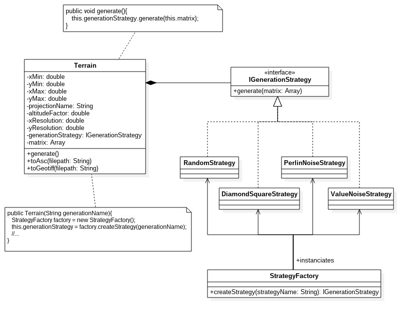
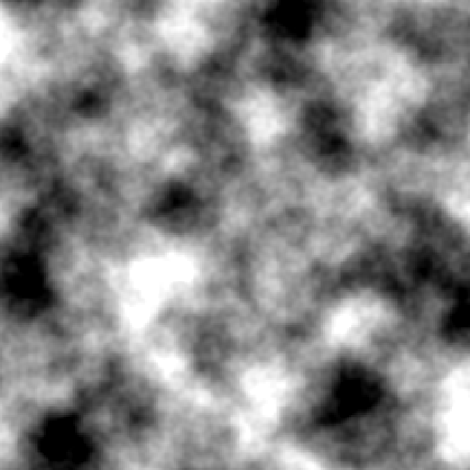
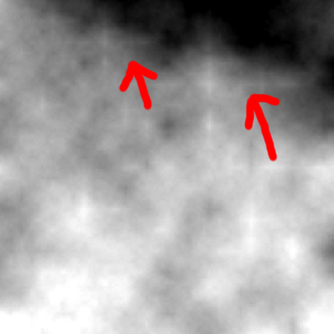

# TSI 2017, Projet personnel 2
## Sujet n°3 : API de génération de terrain aléatoire
## Amaury Zarzelli

### Sujet :
La génération de terrain aléatoire consiste à simuler un MNT, par exemple afin d’offrir aux joueurs 
d’un jeu vidéo, une expérience différente à chaque partie.
L’objectif du projet est d’implémenter au moins un algorithme de génération de terrain aléatoire.
Objectifs :
- Génération d’un MNT aléatoire
- Différents algorithmes : aléatoire pur, Diamond Square, etc.
- Chargement d’une couche de données géographiques pour définir l’emprise du MNT
- Export du MNT : ASC et géotiff.

### Conduite du projet
#### Analyse du sujet
La première étape du projet a été d'analyser le sujet, et ce selon plusieurs aspects : la lecture/écriture de fichiers géographiques, l'architecture de l'API et les algorithmes de génération aléatoire dans l'état de l'art. Les résultats de cette phase d'analyse sont présentés dans la section ["Choix techniques"](#choix-techniques).

#### Test Driven Development
Ce projet a été la première occasion pour moi d'appliquer le développement piloté par les tests, appliquer cette méthode strictement m'a donc un peu ralenti de prime abord. Une fois la première version du diagramme de classes terminée, j'ai créé les différents fichiers de classes avec les attributs, mais sans les méthodes (ou sans les implémentations pour les interfaces).
Ensuite, la première étape a été d'écrire quelques tests qui vérifient le comportement normal de la bibliothèque. Après implémentation de ces comportements, j'ai écrit des tests pour les cas limites, pour ensuite les traiter dans le code. Tout ceci a été fait de manière itérative.
Cependant, j'ai eu des difficultés à appliquer cette méthode dès lors qu'il s'agissait de tester le comportement des générations aléatoires. Ainsi, les tests sur les classes de génération de terrain ne portent que sur des comportements globaux, et sur l'assurance de l'absence d'erreur à l'exécution dans des cas habituels.

#### Étapes du développement
J'ai décidé dans le développement de tout d'abord créer une bibliothèque totalement fonctionnelle (de la lecture de fichier à l'écriture) avec une seule méthode de génération (la plus simple, l'aléatoire pur), et d'ajouter les différents algorithmes de génération à la fin.
La première étape a donc été d'implémenter la méthode de génération aléatoire pure (très court), puis de tester le comportement de la classe principale avec ces premiers résultats, puis de réaliser la lecture de fichiers et enfin l'écriture de fichiers.
Plusieurs méthodes de génération (plus complexes) ont été rajoutées une fois le processus complet testé et fonctionnel.

### Choix techniques
#### Lecture/écriture de fichier géographiques
Pour la lecture et l'écriture de fichiers géographiques, j'avais au départ 2 pistes de bibliothèques : GDAL et GeoTools. Après plusieurs recherches sur Internet, j'ai constaté que la communauté était plus active sur GeoTools (plus de questions sur les forums, etc) et que cette bibliothèque permettait la lecture et l'écriture de fichiers assez simplement. J'ai donc opté pour cette solution. 

#### Algorithmes de génération de terrain
Mis à part l'aléatoire pur, j'ai implémenté 3 algorithmes de génération de terrain cohérent :
+ L'algorithme diamant-carré, qui est très bien documenté et est un classique dans l'état de l'art,
+ Le bruit de Perlin, lui aussi très utilisé (que j'ai trouvé un peu plus complexe que les autres),
+ Un bruit aléatoire qui repose sur une somme de valeurs aléatoires calculées à différentes échelles et lissées.

#### Encapsulation pour l'utilisateur
Le diagramme de classes présenté dans la section ["Modélisation UML"](#modelisation-uml) a été pensé pour encapsuler le plus possible les opérations réalisées, afin qu'un utilisateur normal de l'API n'ait à utiliser qu'une classe ainsi que peu de méthodes.

### Modélisation UML

Le coeur de l'API est l'application Terrain, qui par l'intermédiaire d'interfaces (génération, lecture, écriture) permet de réaliser toutes les opérations nécessaires.

Les interfaces IWriter et IFileReader permettent la gestion de la lecture/écriture à l'extérieur de la classe Terrain. Elles sont appelées au moment de l'instanciation du Terrain à partir d'un fichier, et à l'appel des fonctions toAsc() et toGeotiff().

#### Patrons de conception utilisés
+ Patron stratégie, pour la gestion des différentes méthodes de génération au sein de la même classe centrale, sans que cette dernière ne soit responsable de l'implémentation de ces méthodes. L'interface IGenerationStrategy permet aussi l'ajout de nouvelles méthodes de génération de manière transparente pour la classe terrain, car la méthode Terrain.generate() appelle la fonction generate() de l'interface. 
+ Patron fabrique, pour pouvoir ajouter plus facilement des méthodes de génération de terrain, et pour pouvoir encapsuler la génération d'instances de classes stratégies pour l'utilisateur (utilisation d'un chaîne de caractère correspondant au nom de la stratégie plutôt qu'instanciation d'une classe).

### Résultats obtenus :
Voici les résultats obtenus pour les 3 méthodes de génération cohérente (l'aléatoire pur donnant un simple bruit blanc)

Algorithme diamant-carré :

Bruit de Perlin : (on remarque que le résultat est à une échelle différente, "dézoomée")

Bruit aléatoire : (présence de nombreux artéfacts)

